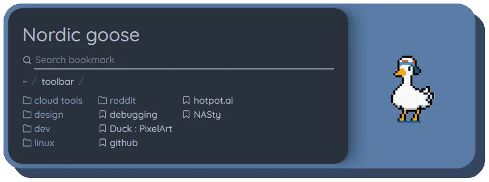

# [Nordic goose](https://addons.mozilla.org/en-US/firefox/addon/nordic-goose/)

Nordic goose is a new tab extension (aka startpage) with nord colors and a dancing goose.

Features:

<ul style="list-style: none; padding-left: 16px;">
  <li>🦆 Look at a dancing goose</li>
  <li>🎨 Beautiful new tab page</li>
  <li>📂 Navigate through your bookmarks</li>
  <li>⌨️ With full keyboard support</li>
  <li>👀 Filter your bookmarks</li>
</ul>

> Note: This startpage is accompanied by an [firefox theme](https://addons.mozilla.org/en-US/firefox/addon/nord-goose/).

## Development setup

JS library: [solid-js](https://www.solidjs.com/)<br/>
CSS framework: [vanilla-extract](https://vanilla-extract.style/)<br/>

Provided scripts:

```
// Start local development
npm run start

// Lint the code
npm run lint:fix

// Transpile to javascript
npm run build

// Validate the extension
npm run ext:lint

// Build the extension
npm run ext:build
```
